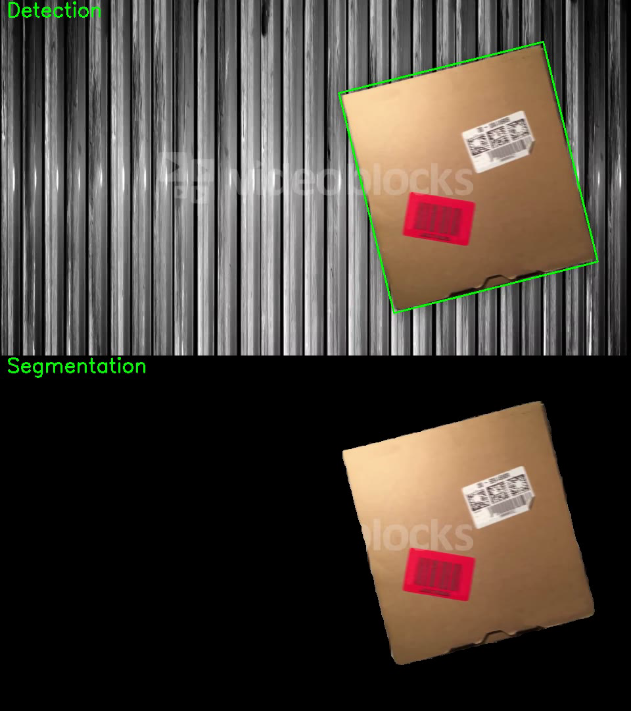
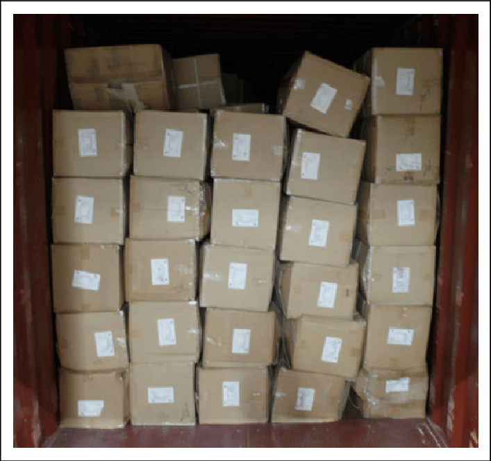

# Cardboard Box Detection and Segmentation
Cardboard box detection and segmentation is important for many robotics applications. A quick skim through this 
[Editor’s Picks: best robots of ProMat 2023 article](https://www.therobotreport.com/editors-picks-best-robots-of-promat-2023/)
is sufficient to understand that. I was recently inspired by a Computer Vision Technical Lead to start focusing more on 
No Deep Learning based methods for solving vision problems, when it comes to robotics. 
With that in mind, I wanted to address the simplest problem I could find. For now that is the detection and segmentation 
of cardboard boxes. 

I used a preview video from [Storyblocks](https://www.storyblocks.com/video/stock/boxes-and-packages-move-along-a-conveyor-belt-in-a-shipment-factory-a-few-blank-boxes-for-your-custom-graphics-lmgxtwq).  
Link to [Output Video](https://youtube.com/shorts/sOGK0oT4cKc)  
The method is the following:
1. Gaussian blur image.
2. BGR -> HSV color space conversion.
3. Threshold image in the Saturation space using the OTSU method.
4. Find biggest external contour.
5. Calculate bounding box and segmentation mask for the box.

## References:
https://stackoverflow.com/questions/72290119/detecting-cardboard-box-and-text-on-it-using-opencv/75872953#75872953  
https://www.ronan.bzh/p/computer-vision-detection-of-a-box-on-a-industrial-conveyor/  
https://docs.opencv.org/4.x/d4/d73/tutorial_py_contours_begin.html  

## Next:
The above algorithm worked because the background was relatively easy. However, the same will not work on a container 
full of cardboard boxes as shown below.  
  
There are many robots that target unloading cardboard boxes from a shipping container. 
E.g [Boston Dynamics’ Stretch](https://www.bostondynamics.com/products/stretch) or   
[Mujin's Truck Bot](https://mujin-corp.com/truckbot-automated-truck-unloader/).
Just for fun, I would like to experiment on how to detect and count cardboard boxes in such environment. Then try to 
detect the optimal gripping/suction plane for the boxes so that the robot can grab them.